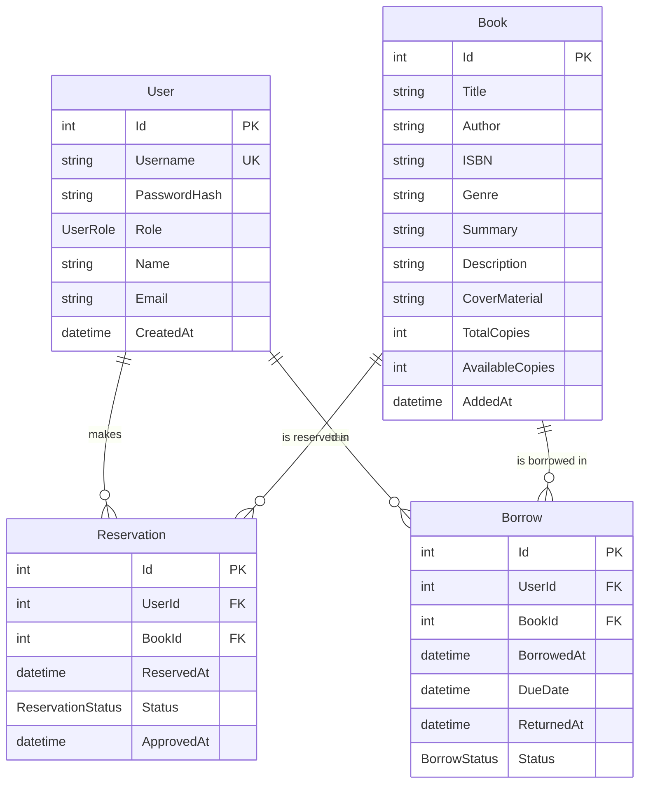
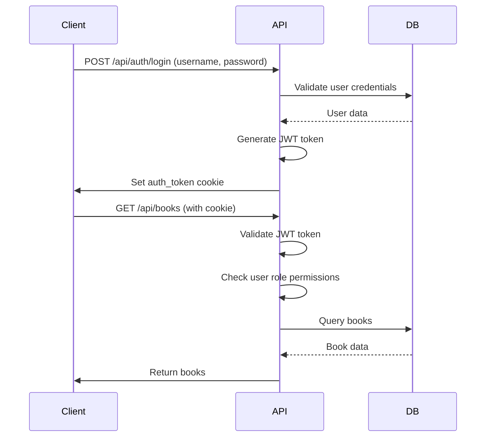
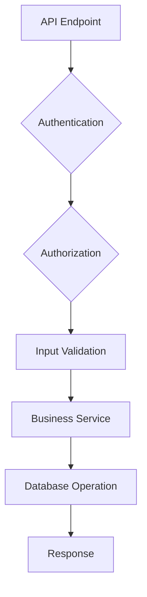
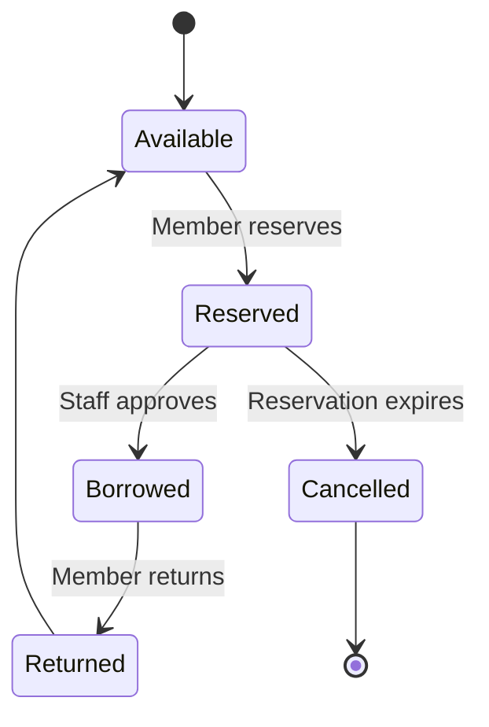
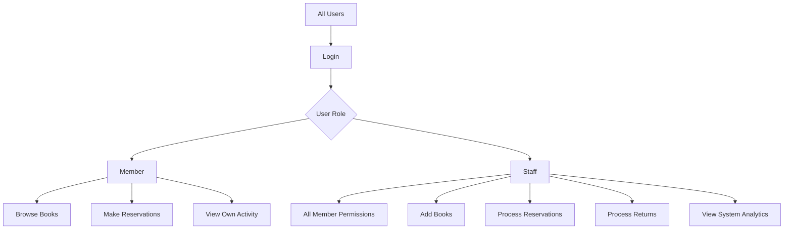

# PearlLibrary Backend

The backend component of the PearlLibrary system, built with ASP.NET Core Minimal APIs and Entity Framework Core.

## 🏗️ Architecture Overview

This backend follows a clean architecture approach using ASP.NET Core Minimal APIs, providing a lightweight yet powerful REST API for library management.

### Core Principles
- **Minimal APIs**: Leveraging ASP.NET Core's minimal API features for concise, high-performance endpoints
- **Entity Framework Core**: ORM for PostgreSQL database operations
- **JWT Authentication**: Secure token-based authentication with cookies
- **Role-Based Authorization**: Granular access control for Members and Staff
- **Clean Code**: Organized into logical layers with separation of concerns

## 📁 Project Structure

```
backend/
├── Models/           # Domain entities and DTOs
│   ├── User.cs
│   ├── Book.cs
│   ├── Reservation.cs
│   ├── Borrow.cs
│   └── DTOs/
├── Data/             # Database context and configurations
│   └── LibraryDbContext.cs
├── Services/         # Business logic services
├── Validators/       # Input validation logic
├── Filters/          # Custom filters and middleware
├── Migrations/       # EF Core database migrations
├── Program.cs        # Application entry point and configuration
├── appsettings.json  # Configuration files
└── Backend.csproj    # Project file
```

## 🗄️ Database Schema



## 🔐 Authentication & Authorization Flow



## 🚀 API Endpoints Architecture

### Authentication Layer
- **JWT Bearer Authentication**: Validates tokens from cookies
- **Role-based Policies**: Member and Staff authorization
- **Cookie Management**: Secure HttpOnly cookies for token storage

### Business Logic Layer


### Key Workflows

#### Book Reservation Flow


#### User Roles & Permissions


## 🛠️ Technologies Used

- **ASP.NET Core 10.0**: Web framework with Minimal APIs
- **Entity Framework Core 10.0**: ORM for database operations
- **PostgreSQL**: Primary database
- **JWT Bearer Authentication**: Token-based security
- **OpenAPI/Swagger**: API documentation
- **BCrypt.Net**: Password hashing (recommended for production)

## 🔧 Configuration

### Database Connection
```json
{
  "ConnectionStrings": {
    "LibraryDb": "Host=localhost;Database=postgres;Username=postgres;Password=password"
  }
}
```

### JWT Settings
```json
{
  "Jwt": {
    "Key": "YourSuperSecretKeyHere12345678901234567890",
    "Issuer": "PearlLibrary",
    "Audience": "PearlLibrary"
  }
}
```

## 📊 API Endpoints Summary

| Endpoint | Method | Role | Description |
|----------|--------|------|-------------|
| `/api/auth/login` | POST | All | User authentication |
| `/api/books` | GET | All | Browse/search books |
| `/api/books` | POST | Staff | Add new books |
| `/api/reservations` | POST | Member | Create reservation |
| `/api/reservations` | GET | Member | View reservations |
| `/api/reservations/{id}/approve` | POST | Staff | Approve reservation |
| `/api/borrows` | GET | Member | View active borrows |
| `/api/returns/{id}` | POST | Staff | Process returns |
| `/api/dashboard/member` | GET | Member | Member statistics |
| `/api/dashboard/staff` | GET | Staff | Staff analytics |

## 🚀 Deployment Considerations

- **Database Migrations**: Run `dotnet ef database update` on deployment
- **Environment Variables**: Use for sensitive configuration in production
- **HTTPS**: Required for secure cookie transmission
- **Password Hashing**: Implement proper hashing for production use
- **Logging**: Configure appropriate log levels for production
- **Rate Limiting**: Consider implementing for API protection

## 🧪 Testing

Use the Swagger UI at `/swagger` for interactive testing.

## 🔄 Development Workflow

1. **Database Changes**: Create migrations with `dotnet ef migrations add`
2. **API Changes**: Update endpoints in `Program.cs`
3. **Testing**: Use Swagger UI or REST client
4. **Validation**: Run `dotnet build` and test endpoints

This architecture provides a scalable, maintainable foundation for the library management system with clear separation of concerns and modern .NET practices.